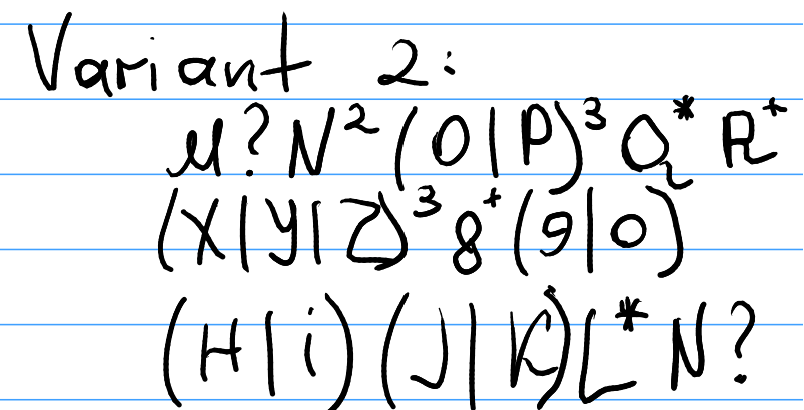

# Laboratory Work No. 4

### Course: Formal Languages & Finite Automata
### Author: Artur Tugui
### Group: FAF-231

----

## Theory
Regular expressions (regex) are a powerful tool used in programming, text processing, and data validation to search for and manipulate strings that match a specific pattern. A regular expression defines a search pattern that can be used for matching, extracting, replacing, or validating text.

At its core, a regular expression is a sequence of characters that define a search pattern. The simplest form of regex is a literal string. A literal character matches itself exactly in the target text. For example, the regex `abc` matches the string "abc" anywhere in the text.

Regex also includes metacharacters, which are characters that have special meanings and are used to define patterns rather than matching literal characters. Some of the most common metacharacters include the dot (`.`), caret (`^`), dollar sign (`$`), asterisk (`*`), plus (`+`), question mark (`?`), square brackets (`[ ]`), parentheses (`( )`), and pipe (`|`). The dot (`.`) matches any single character except a newline. The caret (`^`) matches the start of a line or string, while the dollar sign (`$`) matches the end of a line or string. The asterisk (`*`) matches zero or more occurrences of the preceding element, and the plus (`+`) matches one or more occurrences of the preceding element. The question mark (`?`) matches zero or one occurrence of the preceding element, and square brackets (`[ ]`) allow for matching any one of the characters inside the brackets. Parentheses (`( )`) are used to group parts of the pattern and capture the matched text. Finally, the pipe (`|`) acts as a logical OR, matching either the pattern before or after the pipe.

Quantifiers specify how many times an element in the regex should be matched. For example, `{n}` matches exactly **n** occurrences of the preceding character or group, while `{n,}` matches **n** or more occurrences. `{n,m}` matches between **n** and **m** occurrences of the preceding character or group.

##  Objectives:

1. Write and cover what regular expressions are, what they are used for;

2. Below you will find 3 complex regular expressions per each variant. Take a variant depending on your number in the list of students and do the following:

   a. Write a code that will generate valid combinations of symbols conform given regular expressions (examples will be shown). Be careful that idea is to interpret the given regular expressions dinamycally, not to hardcode the way it will generate valid strings. You give a set of regexes as input and get valid word as an output

   b. In case you have an example, where symbol may be written undefined number of times, take a limit of 5 times (to evade generation of extremely long combinations);

   c. **Bonus point**: write a function that will show sequence of processing regular expression (like, what you do first, second and so on)

Write a good report covering all performed actions and faced difficulties.

##  Variant no. 2

## Implementation description

The `RegexProcessor` class processes a given regular expression (regex) string to generate a valid string based on the pattern defined by the regex. The core functionality revolves around analyzing the regex elements, identifying quantifiers, groups, and choices, and then generating a string according to these components.

### **Key Concepts and Processing Flow**

1. **`generateValidString` function:**
    - This is the main function responsible for processing the regular expression.
    - The function uses a `StringBuilder` to construct a valid string that matches the given regex pattern.
    - The regex string is iterated character by character to identify and handle different components (such as groups, quantifiers, and simple characters).
    - If a group (enclosed in parentheses) is found, it extracts and processes the content inside the group. If the group contains a choice (denoted by `|`), it splits the group into possible choices and processes each choice according to its quantifier.
    - The function checks if the current element in the regex is followed by a quantifier (such as `*`, `+`, `?`, or `{n}`). Depending on the quantifier, it appends the appropriate number of characters to the valid string.
    - For simple alphanumeric characters, it appends the character directly to the resulting string.
    - Throughout the process, explanatory messages are printed to the console to show each step of regex processing.

2. **`choiceExtractor` function:**
    - This function takes a regex group element (such as `a|b|c`) and splits it into individual choices using the pipe (`|`) symbol.
    - It returns an `ArrayList` of the extracted choices, which will later be used to generate a valid string based on a random selection from the choices.

3. **`handleQuantifiers` function:**
    - This function handles quantifiers that follow a regex element.
    - For each quantifier:
        - `*`: Appends the element 0 to 5 times.
        - `+`: Appends the element 1 to 5 times.
        - `?`: Appends the element 0 to 1 time.
        - `{n}`: Appends the element a specified `n` and `m` times.
    - The function uses a `Random` object to decide how many times to append the element according to the quantifier.

4. **`handleQuantifiersChoice` function:**
    - This function processes quantifiers in a choice-based group (like `(a|b|c)`).
    - Similar to `handleQuantifiers`, it handles quantifiers but instead of appending a single element, it randomly chooses one of the available options in the `choices` list.
    - It also uses a `Random` object.

### **Processing Steps in the Code**

1. **Group Processing:**
    - The function first checks if the current element is the start of a group (denoted by `(`). If a group is found, the code searches for the corresponding closing parenthesis (`)`) and extracts the content inside the group.
    - If the group contains a choice (e.g., `a|b`), the choices are extracted, and the quantifiers are handled.

2. **Quantifier Handling:**
    - The function looks for quantifiers (e.g., `*`, `+`, `?`, `{n}`) that follow the regex element. Based on the quantifier, it decides how many times to repeat the element.
    - Quantifiers are processed using `Random` to determine the number of repetitions for each element.

3. **String Construction:**
    - Throughout the process, the valid string is built by appending the processed elements to the `StringBuilder` object.
    - Explanatory messages are printed to show how each regex element is handled.

### Unit Tests for RegexProcessor

The following unit tests are designed to check various functionalities of the `RegexProcessor` class:

1. **testGrouping**
    - Validates if the correct string is returned for a simple group `(abba)`.

2. **testGroupingError**
    - Tests the error handling when a group is incomplete (missing closing parenthesis).

3. **testChoiceExtraction**
    - Checks if the choice extractor correctly splits a string with multiple options (`ab|c|3|d3`).

4. **testStar**
    - Validates the `*` quantifier (zero or more repetitions).

5. **testStar2**
    - Validates if the `*` quantifier is applied correctly in the regex `a*b` (should always contain "b").

6. **testPlus**
    - Validates the `+` quantifier (one or more repetitions).

7. **testQuestionMark**
    - Tests the `?` quantifier (zero or one occurrence).

8. **testBrackets**
    - Validates the `{}` quantifier (exactly `n` repetitions, e.g., `a{3}` should result in "aaa").

9. **testChoice**
    - Tests a choice between multiple options `(a|b|c)` and verifies the result is one of the options.

10. **testGroupBrackets**
    - Validates if the group with a quantifier `(ab){2}` correctly produces "abab".

## Results

The program displays how it constructs a valid string from each regex.

## Conclusions

The goal of this lab was to create a system that generates valid strings based on dynamic regular expressions. The RegexProcessor class successfully parses and interprets regex patterns, handling elements like groups, quantifiers, and choices to generate strings accordingly.

Challenges included managing complex patterns, especially group choices with quantifiers, and ensuring proper randomization within quantifier limits. Unit tests validated that the class could correctly process regex constructs and handle errors such as incomplete groups.

In summary, the lab demonstrated the ability to generate strings from dynamic regular expressions while reinforcing key concepts from formal languages and finite automata.

## References

UTM LFA course, univ. lect. Irina Cojuhari, Theme 3, https://drive.google.com/file/d/1UuQZz-xybc4JhTnm_RgCvybvmnrqGfG2/view
