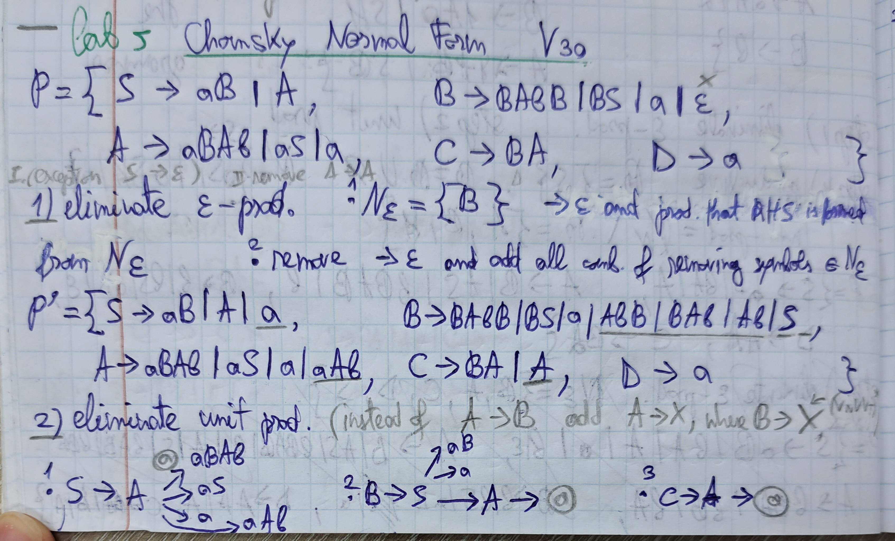
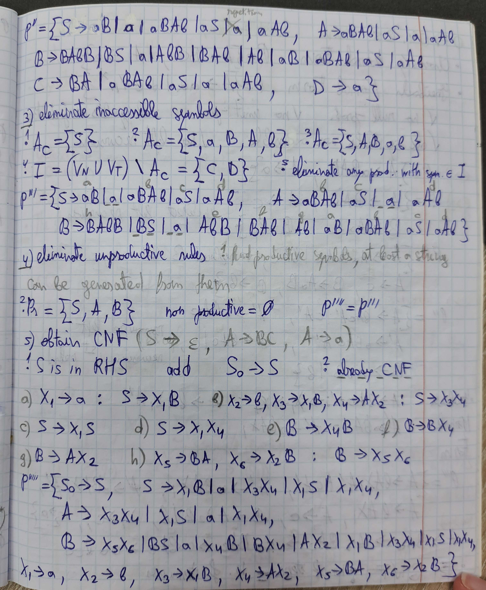

# Laboratory Work No. 5

### Course: Formal Languages & Finite Automata
### Author: Artur Tugui
### Group: FAF-231

----

## Theory
Chomsky Normal Form (CNF) is a specific way to express context-free grammars where each production rule follows a restricted format. This form is commonly used in theoretical computer science and compiler design because it simplifies parsing and analysis.

A grammar is in CNF if every production rule is in one of the following forms: a non-terminal producing exactly two non-terminals (for example, A → BC), a non-terminal producing a single terminal symbol (like A → a), or the start symbol producing the empty string ε, but only if the empty string is part of the language generated by the grammar.

There are several important constraints in CNF. ε-productions are not allowed, except for the start symbol if the language includes the empty string. Unit productions, where one non-terminal produces another single non-terminal (such as A → B), are also disallowed. Additionally, rules where terminals and non-terminals are mixed (for example, A → aB) or where more than two symbols appear on the right-hand side (like A → BCD) are not permitted. All symbols used must also be productive and reachable.

Converting a grammar to CNF is particularly useful for applications such as the CYK (Cocke–Younger–Kasami) parsing algorithm. It also plays a significant role in proving properties of formal languages and automating syntax analysis in compilers.

Chomsky Normal Form offers a standardized way to represent context-free grammars that makes them easier to process using algorithms without changing the languages they generate.

##  Objectives:

1. Learn about Chomsky Normal Form (CNF).
2.  Get familiar with the approaches of normalizing a grammar. 
3. Implement a method for normalizing an input grammar by the rules of CNF.
i. The implementation needs to be encapsulated in a method with an appropriate signature (also ideally in an appropriate class/type).
ii. The implemented functionality needs executed and tested.
iii. Also, another BONUS point would be given if the student will make the aforementioned function to accept any grammar, not only the one from the student's variant.

##  Variant no. 30

## Implementation description

The `ConverterToCNF` class provides static methods to transform a context-free grammar (CFG) into Chomsky Normal Form (CNF). The transformation includes removing self-loops, epsilon productions, unit productions, inaccessible and unproductive symbols, and recomputing the set of used terminals and non-terminals. The overall goal is to simplify the grammar for parsing or theoretical analysis.

---

### Key Concepts and Processing Flow

1. `removeSelfLoopProductions` function:
   - Filters out productions of the form `A → A`.
   - Creates a new list of productions excluding self-loops.
   - Recomputes the grammar's terminals and non-terminals.

2. `removeEpsilonProductions` function:
   - Step 1: Identifies all nullable symbols (those deriving ε directly or indirectly).
   - Step 2: Removes epsilon productions from the grammar.
   - Step 3: Adds new productions by removing each nullable symbol from right-hand sides to simulate optional presence.
   - Step 4: If the start symbol is nullable, adds back the epsilon production `S → ε`.
   - Finalizes changes and recomputes symbols.

3. `consistsOnlyOf` helper function:
   - Checks if all symbols in a list are part of a provided set (used for verifying nullability).

4. `indexOfNthOccurrence` helper function:
   - Returns the index of the nth occurrence of any symbol in the set within the given list.

5. `removeUnitProductions` function:
   - Step 1: Separates unit productions (e.g., `A → B`) from others.
   - Step 2: Repeatedly replaces unit productions with the RHS of the target non-terminal (`A → B` and `B → x` becomes `A → x`).
   - Step 3: Continues until no new unit productions can be generated.
   - Updates grammar with non-unit productions only and recomputes symbols.

6. `recomputeSymbols` function:
   - Scans all productions to determine which non-terminals and terminals are actually used.
   - Updates the grammar’s terminal and non-terminal sets accordingly.

7. `removeInaccessibleSymbols` function:
   - Step 1: Initializes with the start symbol as accessible.
   - Step 2: Iteratively adds symbols reachable from accessible ones.
   - Step 3: Removes all productions involving symbols that are never reached from the start symbol.
   - Final step updates the grammar's terminal and non-terminal sets.

8. `removeUnproductiveSymbols` function:
   - Step 1: Identifies productive non-terminals (those that can derive terminal strings).
   - Step 2: Iteratively includes non-terminals that can derive terminals or other productive non-terminals.
   - Step 3: Removes all productions involving unproductive symbols.
   - Recomputes grammar symbols after updates.

9. **`eliminateProductionsWithNonsolitaryTerminals`**:
   - Iterates over all productions in the grammar.
   - For productions with a right-hand side (RHS) longer than 1 that contains any terminal symbols, it replaces each terminal with a new non-terminal `Xi` such that `Xi → terminal`.
   - Stores these new rules in a map to avoid duplication for the same terminal.
   - Updates the RHS of the original production by substituting terminals with corresponding `Xi`.
   - Adds both the updated productions and the newly created single-terminal productions to the grammar.
   - Calls `recomputeSymbols` to update terminal and non-terminal sets.

10. **`eliminateLargeRHS`**:
   - Scans all productions where the RHS contains only non-terminals and has a length greater than 2.
   - Breaks such RHS chains into binary productions by introducing new non-terminals.
   - For example, transforms `A → B C D` into:
      - `A → B X1`
      - `X1 → C D`
   - Stores combinations of non-terminal pairs to prevent creating multiple non-terminals for the same RHS.
   - Adds the newly generated productions and updates the grammar’s production list.
   - Calls `recomputeSymbols` to refresh the grammar structure.

11. **`checkForS0`**:
   - Checks if the start symbol `S` appears on the RHS of any production.
   - If it does, introduces a new start symbol `S0` and a new production `S0 → S`.
   - Updates the grammar to use `S0` as the new start symbol.
   - If the original `S` had an epsilon production `S → ε`, it is removed and replaced with `S0 → ε` to preserve derivability of the empty string.

---

### Processing Steps Summary

- Remove reflexive productions like `A → A`.
- Remove ε-productions and simulate their effect with alternative rules.
- Replace indirect derivations like `A → B → x` with `A → x`.
- Retain only those symbols reachable from the start symbol.
- Keep only symbols that eventually derive terminals.
- Eliminate productions with nonsolitary terms
- Eliminate right hand sides with more than 2 non-terminals
- Check if `S0` needs to be introduces
- Symbol Recalculation: Maintain consistency of the grammar's declared non-terminals and terminals.

These functions systematically transform any CFG into an equivalent one in CNF, maintaining its language while conforming to the CNF structure requirements.

### Unit Tests for `ConverterToCNF`

1. `removeSelfLoopProductionsTest`: Tests the removal of self-loop productions from the grammar, ensuring they are properly removed.

2. `removeEpsilonProductionsTest2`: Tests the removal of epsilon (empty string) productions, ensuring epsilon rules are correctly substituted and removed.

3. `removeEpsilonProductionsTest1`: Tests the removal of epsilon productions in a grammar with multiple epsilon rules, ensuring they are correctly handled.

4. `removeUnitProductionsTest1`: Tests the removal of unit productions (where a non-terminal directly produces another non-terminal), ensuring they are properly eliminated.

5. `removeUnitProductionsTest2`: Tests the removal of unit productions where the non-terminals produce other non-terminals in a chain, ensuring correct elimination.

6. `removeUnitProductionsTest3`: Tests the removal of unit productions in a more complex set of non-terminals, ensuring they are correctly handled.

7. `removeNonexistingSymbolsTest1`: Tests the removal of non-existing symbols from the grammar, ensuring the grammar is updated properly after their removal.

8. `removeInaccessibleSymbolsTest1`: Tests the removal of inaccessible symbols from the grammar, ensuring they are correctly identified and removed.

9. `removeInaccessibleSymbolsTest2`: Tests the removal of inaccessible symbols in a more complex grammar, ensuring correct identification and removal.

10. `removeUnproductiveSymbolsTest1`: Tests the removal of unproductive symbols (symbols that do not lead to terminal symbols), ensuring they are properly removed.

11. `removeUnproductiveSymbolsTest2`: Tests the removal of unproductive symbols in a more complex grammar, ensuring they are correctly identified and removed.

## Results
Variant 31 done manually

Variant 31 done by the program

To prove that my code works with any CFG i also made Variant 21

## Conclusions

In conclusion, this lab focused on converting context-free grammars (CFG) into Chomsky Normal Form (CNF) through various transformations, including the removal of self-loop productions, epsilon productions, unit productions, and inaccessible or unproductive symbols. The implemented ConverterToCNF class successfully applied these transformations, ensuring the grammar adhered to CNF rules while maintaining its language.

Unit tests validated the correctness of the transformations, confirming the proper removal of unwanted productions and the update of the grammar. This lab provided valuable hands-on experience with CNF, reinforcing essential concepts in formal languages and automata theory, and demonstrated how CFG normalization simplifies grammar for parsing and theoretical analysis.

## References

UTM LFA course, univ. lect. Irina Cojuhari, Theme 4, https://drive.google.com/file/d/19muyiabGeGaoNDK-7PeuzYYDe6_c0e-t/view
