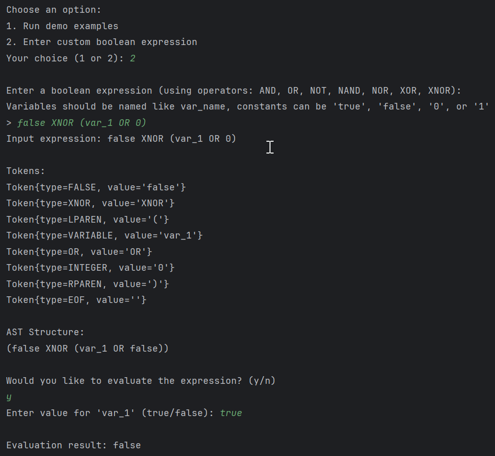

# Laboratory Work No. 6

### Course: Formal Languages & Finite Automata
### Author: Artur Tugui
### Group: FAF-231

----

## Theory

Parsing is the process of analyzing a string of symbols according to the rules of a formal grammar. It transforms input text into a data structure (typically a parse tree or Abstract Syntax Tree) that represents the syntactic structure of the input according to the grammar. This process is fundamental in compiler design, programming language interpretation, and natural language processing.

An Abstract Syntax Tree (AST) is a tree representation of the abstract syntactic structure of source code. Unlike a concrete syntax tree, an AST doesn't represent every detail from the real syntax, but rather captures the structural and content-related details necessary for compilation or interpretation. Each node in the AST denotes a construct occurring in the source code.

The parsing process typically follows these steps:
1. **Lexical Analysis (Tokenization)**: Breaking the input into tokens
2. **Syntactic Analysis**: Analyzing the tokens against grammar rules to create an AST
3. **Semantic Analysis**: Checking the AST for semantic correctness

In the context of boolean expressions, the AST nodes might represent operations (AND, OR, NOT), operands (variables, constants), and their hierarchical relationships. This structure allows for easier evaluation, optimization, and transformation of the expressions.

## Objectives:

1. Get familiar with parsing, what it is and how it can be programmed.
2. Get familiar with the concept of AST.
3. In addition to what has been done in the 3rd lab work:
   1. Implement a TokenType enumeration to categorize tokens, using regular expressions for identification.
   2. Implement the necessary data structures for an AST for boolean expressions.
   3. Implement a simple parser program to extract syntactic information from the input text.

## Implementation Description

### TokenType Enumeration

The `TokenType` was left unchanged from laboratory no. 3:

```java
public enum TokenType {
    TRUE, FALSE, // boolean literals
    AND, OR, NOT, // basic logic operators
    NAND, NOR, XOR, XNOR, // other logic operators
    LPAREN, RPAREN, // parantheses
    INTEGER, VARIABLE, // Integer(0,1) and boolean variables
    EOF
}
```

### Enhanced Lexer with Regular Expressions

The `Lexer` class was modified into a new `RegexLexer` class that uses regular expressions for token identification instead of strings:

```java
// Define regex patterns for each token type
private static final Pattern WHITESPACE_PATTERN = Pattern.compile("^\\s+");
private static final Pattern TRUE_PATTERN = Pattern.compile("^true");
private static final Pattern FALSE_PATTERN = Pattern.compile("^false");
private static final Pattern AND_PATTERN = Pattern.compile("^AND");
private static final Pattern OR_PATTERN = Pattern.compile("^OR");
private static final Pattern NOT_PATTERN = Pattern.compile("^NOT");
private static final Pattern NAND_PATTERN = Pattern.compile("^NAND");
private static final Pattern NOR_PATTERN = Pattern.compile("^NOR");
private static final Pattern XOR_PATTERN = Pattern.compile("^XOR");
private static final Pattern XNOR_PATTERN = Pattern.compile("^XNOR");
private static final Pattern LPAREN_PATTERN = Pattern.compile("^\\(");
private static final Pattern RPAREN_PATTERN = Pattern.compile("^\\)");
private static final Pattern INTEGER_PATTERN = Pattern.compile("^[01]");
private static final Pattern VARIABLE_PATTERN = Pattern.compile("^[a-zA-Z][a-zA-Z0-9_]*");
```

The tokenize method uses these patterns to identify tokens in the input string:

```java
public List<Token> tokenize() {
    List<Token> tokens = new ArrayList<>();

    while (position < input.length()) {
        String remainingInput = remaining();
        
        // Skip whitespace
        if (matchAndAdvance(WHITESPACE_PATTERN) > 0) {
            continue;
        }
        
        // Match tokens using regex patterns
        if (matchAndAdvance(TRUE_PATTERN) > 0) {
            tokens.add(new Token(TokenType.TRUE, "true"));
        }
        else if (matchAndAdvance(FALSE_PATTERN) > 0) {
            tokens.add(new Token(TokenType.FALSE, "false"));
        }
        // Additional pattern matching for other token types...
    }

    tokens.add(new Token(TokenType.EOF, ""));
    return tokens;
}
```

### AST Data Structure

For the Abstract Syntax Tree, I implemented several classes to represent the different components of boolean expressions:

1. **ASTNode Interface**: Base for all AST nodes
```java
public interface ASTNode {
    boolean evaluate(ExpressionContext context);
}
```

2. **VariableNode**: Represents a variable in the expression
```java
class VariableNode implements ASTNode {
    private final String name;
    
    public VariableNode(String name) {
        this.name = name;
    }
    
    @Override
    public boolean evaluate(ExpressionContext context) {
        return context.getVariableValue(name);
    }
}
```

3. **LiteralNode**: Represents boolean literals (true, false, 0, 1)
```java
class LiteralNode implements ASTNode {
    private final boolean value;
    
    public LiteralNode(boolean value) {
        this.value = value;
    }
    
    @Override
    public boolean evaluate(ExpressionContext context) {
        return value;
    }
}
```

4. **UnaryOpNode**: Represents unary operations like NOT
```java
class UnaryOpNode implements ASTNode {
    private final TokenType operator;
    private final ASTNode operand;
    
    public UnaryOpNode(TokenType operator, ASTNode operand) {
        this.operator = operator;
        this.operand = operand;
    }
    
    @Override
    public boolean evaluate(ExpressionContext context) {
        boolean operandValue = operand.evaluate(context);
        
        switch (operator) {
            case NOT:
                return !operandValue;
            default:
                throw new RuntimeException("Invalid unary operator: " + operator);
        }
    }
}
```

5. **BinaryOpNode**: Represents binary operations (AND, OR, NAND, NOR, XOR, XNOR)
```java
class BinaryOpNode implements ASTNode {
    private final TokenType operator;
    private final ASTNode left;
    private final ASTNode right;
    
    public BinaryOpNode(TokenType operator, ASTNode left, ASTNode right) {
        this.operator = operator;
        this.left = left;
        this.right = right;
    }
    
    @Override
    public boolean evaluate(ExpressionContext context) {
        boolean leftValue = left.evaluate(context);
        boolean rightValue = right.evaluate(context);
        
        switch (operator) {
            case AND:
                return leftValue && rightValue;
            case OR:
                return leftValue || rightValue;
            case NAND:
                return !(leftValue && rightValue);
            case NOR:
                return !(leftValue || rightValue);
            case XOR:
                return leftValue ^ rightValue;
            case XNOR:
                return !(leftValue ^ rightValue);
            default:
                throw new RuntimeException("Invalid binary operator: " + operator);
        }
    }
}
```

6. **ExpressionContext**: Stores variable values for expression evaluation
```java
class ExpressionContext {
    private final java.util.Map<String, Boolean> variables = new java.util.HashMap<>();
    
    public void setVariableValue(String name, boolean value) {
        variables.put(name, value);
    }
    
    public boolean getVariableValue(String name) {
        if (!variables.containsKey(name)) {
            throw new RuntimeException("Undefined variable: " + name);
        }
        return variables.get(name);
    }
}
```

This structure allows us to represent any boolean expression as a tree of operations and operands, with each node capable of evaluating its own value within a given context.

### Parser Implementation

I implemented a recursive descent parser following a formal grammar for boolean expressions:

```java
// Grammar:
// expression -> term (("XOR" | "XNOR") term)*
// term -> factor (("OR" | "NOR") factor)*
// factor -> unary (("AND" | "NAND") unary)*
// unary -> "NOT" unary | primary
// primary -> "true" | "false" | INTEGER | VARIABLE | "(" expression ")"
```

The parser uses the following methods to build the AST:

```java
public ASTNode parse() {
    ASTNode expr = expression();
    
    // Make sure we've consumed all tokens except EOF
    if (peek().type != TokenType.EOF) {
        throw new RuntimeException("Unexpected token: " + peek().lexeme);
    }
    
    return expr;
}

private ASTNode expression() {
    ASTNode expr = term();
    
    while (match(TokenType.XOR) || match(TokenType.XNOR)) {
        Token operator = previous();
        ASTNode right = term();
        expr = new BinaryOpNode(operator.type, expr, right);
    }
    
    return expr;
}

// Additional parsing methods for term, factor, unary, and primary...
```

This implementation handles operator precedence correctly, where:
- NOT has highest precedence
- AND/NAND has next highest
- OR/NOR has next highest
- XOR/XNOR has lowest precedence

The parser builds the AST bottom-up, ensuring that the tree correctly represents the hierarchical structure of the boolean expression.

## Results
As a custom input I introduced the expression `false XNOR (var_1 OR 0)`.



| var_1 | (var_1 OR 0) | false XNOR (var_1 OR 0) |
|-------|--------------|-------------------------|
| true  | true         | false                   |


## Conclusions

In this laboratory work, I successfully implemented a complete system for parsing and evaluating boolean expressions. The implementation includes a `TokenType` enumeration to categorize tokens, a regex-based lexer for token identification, an AST structure to represent boolean expressions, and a recursive descent parser to build the AST.

The implementation demonstrates several important concepts in parsing and compiler design. These include the separation of lexical analysis (tokenization) from syntactic analysis (parsing), the use of regular expressions for robust token identification, the representation of expressions as hierarchical structures using ASTs, the implementation of operator precedence through a formal grammar, and the evaluation of expressions using the visitor pattern.

This approach provides a solid foundation for more complex language processing tasks and can be extended to handle more sophisticated expressions or even full programming languages. By using a clear separation of concerns between lexing, parsing, and evaluation, the code remains maintainable and extensible.

The use of ASTs provides significant advantages over direct evaluation of expressions. These advantages include the ability to perform optimizations on the tree before evaluation, support for more complex operations like variable substitution, better error reporting and recovery, and the possibility of translating the expression to other formats or languages.

Overall, this laboratory work has provided valuable hands-on experience with fundamental concepts in compiler design and language processing.


## References

1. UTM LFA course, univ. lect. Irina Cojuhari. Topic https://else.fcim.utm.md/mod/resource/view.php?id=26175
